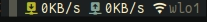
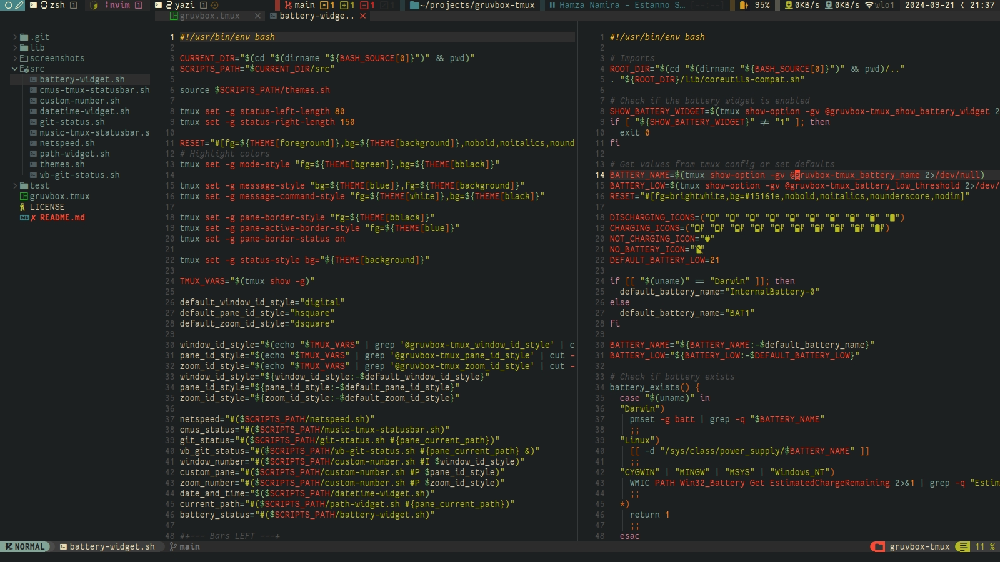

# Gruvbox Tmux

A clean  Tmux theme that  follow the [Gruvbox](https://github.com/morhetz/gruvbox) and Heavily inspired by [Tokyo Night Tmux](https://github.com/janoamaral/tokyo-night-tmux) so, Thanks for them.

## Requirements

This theme has the following hard requirements:

- Any font from [Nerd Fonts](https://www.nerdfonts.com/) 
- [Bash](https://www.gnu.org/software/bash/)

The following are recommended for full support of all widgets and features:

- [Noto Sans] Symbols 2 (for segmented digit numbers)
- [bc] (for netspeed and git widgets)
- [jq], [gh], [glab] (for git widgets)
- [playerctl] (Linux) or [nowplaying-cli] (macOS) for music statusbar
### Linux

#### Alpine Linux

```bash
apk add bash bc coreutils gawk git jq playerctl sed
```

#### Arch Linux

```bash
pacman -Sy bash bc coreutils git jq playerctl
```

#### Ubuntu

```bash
apt-get install bash bc coreutils gawk git jq playerctl
```

Check documentation for installing on other operating systems.


### macOS

macOS still ships with bash 3.2 so you must provide a newer version.
You can easily install all dependencies via [Homebrew]:

```bash
brew tap homebrew/cask-fonts
brew install --cask font-monaspace-nerd-font font-noto-sans-symbols-2
brew install bash bc coreutils gawk gh glab gsed jq nowplaying-cli
```

## Installation using TPM

In your `tmux.conf` add :

```bash
set -g @plugin "https://gitlab.com/motaz-shokry/gruvbox-tmux"
```

## Configuration

### Number styles

Add these lines to your  `.tmux.conf`:

```bash
set -g @gruvbox-tmux_window_id_style digital
set -g @gruvbox-tmux_pane_id_style hsquare
set -g @gruvbox-tmux_zoom_id_style dsquare
```

### Widgets

For widgets add following lines in you `.tmux.conf`

#### Date and Time widget

This widget is enabled by default. To disable it:

```bash
set -g @gruvbox-tmux_show_datetime 0
set -g @gruvbox-tmux_date_format MYD
set -g @gruvbox-tmux_time_format 12H
```

##### Available Options

- `YMD`: (Year Month Day), 2024-01-31
- `MDY`: (Month Day Year), 01-31-2024
- `DMY`: (Day Month Year), 31-01-2024

- `24H`: 18:30
- `12H`: 6:30 PM

#### Now Playing widget

```bash
set -g @gruvbox-tmux_show_music 1
```

#### Netspeed widget


```bash
set -g @gruvbox-tmux_show_netspeed 1
set -g @gruvbox-tmux_netspeed_iface "wlo1" # run `ip a` to see yours
set -g @gruvbox-tmux_netspeed_showip 1      # Display IPv4 address (default 0)
set -g @gruvbox-tmux_netspeed_refresh 1     # Update interval in seconds (default 1)
```

#### Path Widget

```bash
set -g @gruvbox-tmux_show_path 1
set -g @gruvbox-tmux_path_format relative # 'relative' or 'full'
```

#### Battery Widget

```bash
set -g @gruvbox-tmux_show_battery_widget 1
set -g @gruvbox-tmux_battery_name "BAT0"  # some linux distro have 'BAT1'
set -g @gruvbox-tmux_battery_low_threshold 21 # default
```

Set variable value `0` to disable the widget. Remember to restart `tmux` after
changing values.

## Styles

- `none`: no style, default font
- `digital`: 7 segment number (🯰...🯹) (needs [Unicode support])
- `roman`: roman numbers (󱂈...󱂐) (needs nerdfont)
- `fsquare`: filled square (󰎡...󰎼) (needs nerdfont)
- `hsquare`: hollow square (󰎣...󰎾) (needs nerdfont)
- `dsquare`: hollow double square (󰎡...󰎼) (needs nerdfont)
- `super`: superscript symbol (⁰...⁹)
- `sub`: subscript symbols (₀...₉)


### Demo

[Demo](screenshots/recording.mp4)

### Snapshots

- Terminal: St from siduck [St](https://github.com/siduck/st)


